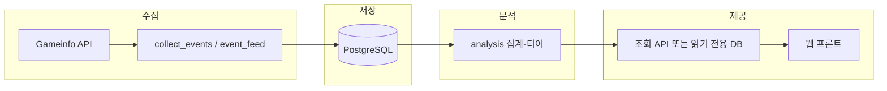

# Albion Analytics — 프로젝트 계획서

이 문서는 **제품 목표**, **최종적으로 만들고자 하는 형태**, **현재 코드베이스와의 관계**를 한곳에 모은 계획서입니다. 운영 규칙·명령·세부 규약은 [AGENTS.md](../AGENTS.md)가 단일 기준이며, 본 문서는 그 내용을 **로드맵 관점**으로 재구성합니다.

---

## 1. 한 줄 요약

알비온 온라인의 **킬·데스(이벤트)** 를 지속 수집해 PostgreSQL에 적재하고, **장비(`type` 기준)·빌드 단위**로 집계·통계를 낸 뒤, 나중에 **웹(op.gg / MetaTFT 스타일)** 으로 티어·순위를 보여주는 데이터 파이프라인·백엔드 기반을 만든다.

---

## 2. 목표

### 2.1 사용자 가치

- 특정 **무기·방어구·악세** 등이 실제 킬 로그에서 **얼마나 쓰이는지**, **어떤 빌드와 자주 짝을 이루는지**, **티어·인챈트 분포**는 어떤지 등을 **데이터 기반**으로 확인할 수 있게 한다.
- 통계는 **원시(raw)** 와 **보정(가중) 적용** 두 관점을 프론트에서 토글할 수 있게 설계한다(보정 수식은 분석 단계에서 확정).

### 2.2 기술 목표

- 비공식 **Gameinfo** HTTP API를 **단일 클라이언트(`GameinfoClient`)** 로 호출하고, Pydantic으로 **느슨한 스키마** 파싱.
- 운영 저장소는 **PostgreSQL**. 이벤트는 **`(source_region, event_id)`** 기준 upsert로 중복 제거.
- **패치 구간**은 `game_patches` + `kill_events.patch_id`로 나누고, API JSON의 `Version`은 **게임 패치와 동일하지 않음**을 전제로 문서화·구현한다.
- 수집·스키마·저장은 **재현 가능한 CLI**(`albion-init-db`, `albion-collect-events` 등)와 테스트로 고정한다.

---

## 3. 최종 구현 형태 (목표 아키텍처)

### 3.1 제품 형태

| 영역 | 최종 형태 |
|------|-----------|
| 데이터 | 지역별 Gameinfo에서 수집한 킬 이벤트가 **시간순·패치별**으로 쌓인 PostgreSQL. |
| 분석 | `analysis`에서 **장비 단위·빌드 키** 집계, 티어/순위 계산, IP·페임·파티 규모 등 **필터·가중** 확장. |
| 서비스 | **집계 결과를 읽는 API**(또는 DB 뷰/머티리얼라이즈드 테이블) + (별도) **웹 프론트**. |
| 웹 | `apps/web` 또는 별도 저장소. **장비 하나 = 상세 페이지** URL은 **`type` 등 안정 ID** 기준. 표시 이름은 메타/매핑. |

현재 저장소에는 **웹 프론트가 포함되지 않음**. 이 패키지는 우선 **수집·스키마·저장·분석(스텁에서 확장)** 까지를 책임지고, 웹은 같은 DB 또는 `pg_dump` 이전으로 연결하는 구조를 목표로 한다.

### 3.2 백엔드·런타임 구성 (목표)

- **상시 수집**: 프로세스가 살아 있는 동안만 폴링. PC 종료·절전 시 구간 공백은 전제. VPS/미니 PC 등 **항상 켜진 환경**으로 보완.
- **다지역**: `COLLECT_REGIONS` 등으로 유럽·미주·아시아 등 **리전별 소스**를 선택·병행할 수 있게 한다.

### 3.3 데이터 모델 방향 (확정 원칙)

- **장비 식별**: canonical 키는 Gameinfo 슬롯의 **`type` 문자열**. 이름만으로 키를 쓰지 않는다.
- **수집 폭**: 가능한 한 넓게 저장하고, **1v1 / 파티 규모** 등은 **집계·조회 필터**로 적용.
- **원시 JSON**: `kill_events.raw_json`에 보존해 스키마 변경·재파싱에 대비.

---

## 4. 단계별 로드맵

### 4.1 0단계 — 완료 또는 진행 중 (코드베이스 기준)

- Gameinfo **HTTP 클라이언트**, 킬 이벤트·장비 **Pydantic 모델**.
- **전역 이벤트 폴링**(`ingestion/event_feed`) 및 **`albion-collect-events`** → Postgres upsert.
- **스키마**: `game_patches`, `kill_events`, `ingestion_cursors` ([schema.py](../src/albion_analytics/storage/schema.py)).
- **초기 분석**: `build_key` 등 빌드 식별 보조, `analysis` 모듈 스텁/요약.

### 4.2 1단계 — 분석·집계 (백엔드 핵심)

- `kill_events` → **장비별·빌드별 롤업 테이블 또는 주기적 배치** (티어 분포, 동반 슬롯 조합 Top-N).
- **관점 필터**: 킬(가해자) vs 데스(피해자) 등 UI 탭과 맞는 쿼리 계약 정리.
- **패치·기간·리전** 필터를 공통 모듈로 묶기.

### 4.3 2단계 — 노출 계층

- 읽기 전용 **HTTP API**(FastAPI 등) 또는 BI 도구가 바로 붙을 수 있는 **뷰/스냅샷 테이블**.
- 인증·레이트 리밋은 공개 범위에 따라 결정.

### 4.4 3단계 — 웹 제품

- 장비 상세, 빌드 조합, **raw / 보정 토글**, (선택) 리전 탭.
- 프론트는 별도 앱으로 두고 본 저장소는 **데이터·집계·API** 에 집중.

---

## 5. 열린 결정 사항 (계획에 반영할 이슈)

아래는 [AGENTS.md](../AGENTS.md)와 동일하게 **아직 확정되지 않은** 영역이다. 구현 순서와 운영 비용에 영향을 준다.

- **킬 스트림 전략**: 전역 `/events` 폴링만으로 충분한지, 시드 플레이어 확장·다른 소스 병행이 필요한지.
- **보정 수식**: IP·페임 정규화·파티 가중 등 수식 확정 후 `analysis`에 반영.
- **장비 페이지 기본 관점**: 킬 중심 vs 데스 중심 vs 탭 병행.

---

## 6. 성공 기준 (제안)

운영·개발 관점에서 다음을 만족하면 “1단계 완료”에 가깝다고 볼 수 있다.

- 선택한 리전에서 **수일 이상** `albion-collect-events`를 돌렸을 때 **중복 없이** 누적되고, 재시작 후에도 커서가 이어진다.
- 특정 `type`(장비)에 대해 **기간·패치·관점**을 바꿔 동일 DB에서 **재현 가능한** 집계 결과를 얻는다.
- 문서만 보고도 **새 환경**에서 `docker compose` + `albion-init-db` + 수집까지 재현 가능하다.

---

## 7. 관련 문서

| 문서 | 역할 |
|------|------|
| [AGENTS.md](../AGENTS.md) | 아키텍처·명령·코딩 규칙·데이터 결정 (단일 기준). |
| [README.md](../README.md) | 설치·환경 변수·빠른 시작. |
| 본 `docs/PROJECT_PLAN.md` | 목표·최종 형태·로드맵 요약. |
| [docs/VPS_SINGLE_HOST_PLAN.md](./VPS_SINGLE_HOST_PLAN.md) | **단일 VPS**에 DB·수집·(향후) API를 두는 운영 설계·단계 계획. |

---

*마지막 갱신: 저장소의 AGENTS.md / README.md 및 `storage/schema.py` 기준으로 정리됨.*
