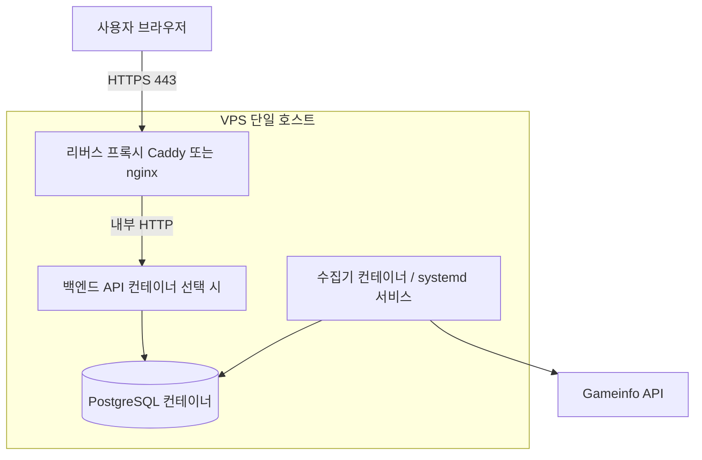

# 단일 VPS 운영 설계·계획

이 문서는 **PostgreSQL + 지속 수집기 + (향후) 웹 백엔드**를 **한 대의 VPS**에 두는 방식의 목표 아키텍처, 단계별 작업, 운영·보안·백업·확장 탈출구를 정리합니다.  
제품 목표·데이터 원칙은 [AGENTS.md](../AGENTS.md), 로드맵 요약은 [PROJECT_PLAN.md](./PROJECT_PLAN.md)를 따릅니다.

---

## 1. 왜 한 대인가

| 이유 | 설명 |
|------|------|
| 비용·단순성 | 초기 트래픽·팀 규모에서 **월 고정비 예측**이 쉽고, 네트워크 홉이 적다. |
| 수집기 특성 | `albion-collect-events`는 **장시간 프로세스**이며 DB와 **지속 연결**이 많다 → 같은 호스트면 단순하다. |
| 현재 코드 정합 | 로컬은 이미 `docker compose`로 **Postgres**를 띄우는 패턴([docker-compose.yml](../docker-compose.yml))과 자연스럽게 이어진다. |

한계: **단일 장애 도메인**(디스크·커널·공급자 장애 시 전부 영향). 이는 **백업·스냅샷·복구 연습**으로 상쇄한다.

---

## 2. 목표 런타임 구성 (VPS 내부)

| 구성요소 | 역할 | 비고 |
|----------|------|------|
| **PostgreSQL** | `kill_events` 등 운영 DB | Docker 볼륨으로 데이터 영속화 |
| **Collector** | `albion-collect-events` 무한 폴링 | `--once` 아님, 재시작 시 커서 이어짐 전제 |
| **리버스 프록시** | TLS 종료, (선택) API 경로 라우팅 | Caddy(자동 HTTPS) 또는 nginx + certbot |
| **백엔드 API** | 집계 조회용 HTTP (2단계 이후) | 없으면 프록시만 두고 수집+DB만 운영 가능 |
| **프론트** | 정적 호스팅을 VPS에 둘 수도 있음 | 보통은 **별도 CDN**(비용·캐시) 권장 |

환경 변수는 서버의 **`.env` 또는 Docker `environment`**에 두고, [`.env.example`](../.env.example)과 동일 키(`DATABASE_URL`, `ALBION_*`, `COLLECT_*`)를 유지한다.

---

## 3. 공급자·스펙 가이드 (초기)

- **공급자 예**: Hetzner, DigitalOcean, Vultr, Linode, Oracle Cloud(무료 티어는 정책 변동), 국내 클라우드 소형 VM.
- **리전**: 주로 붙일 **Gameinfo URL 리전**과 가깝게(지연·타임아웃 완화). 한국 사용자 위주 서비스면 **도쿄/서울 근접**도 함께 고려.
- **스펙(시작점)**: Postgres + 수집기만이면 **1 vCPU / 1–2GB RAM / 20GB+ SSD**로도 가능. API·집계 배치가 붙으면 **2GB RAM** 이상을 여유로 두는 편이 안전하다.
- **OS**: Ubuntu LTS 등 **익숙한 배포판** + 최소 패치 주기를 문서화.

---

## 4. 단계별 실행 계획

### 4.1 0단계 — 서버 준비 (반일 단위)

1. SSH 키 로그인, **root 비밀번호 로그인 비활성화**(가능 시).
2. **방화벽**: 기본 **deny**, 허용은 **22(제한 IP 권장), 80, 443**만.
3. 자동 보안 업데이트(unattended-upgrades 등) 여부 결정.
4. **비밀번호·`DATABASE_URL`은 저장소에 넣지 않음** — 서버 전용 `.env` 또는 Docker secrets.

### 4.2 1단계 — Docker로 DB + 수집 (MVP 운영)

1. 서버에 Docker Engine + Compose plugin 설치.
2. 로컬과 동일하게 **Postgres 서비스** + **영속 볼륨**([docker-compose.yml](../docker-compose.yml) 확장 또는 배포용 `compose.prod.yml` 추가는 구현 시 결정).
3. 최초 1회: `albion-init-db` (스키마).
4. 수집기: `albion-collect-events`를 **컨테이너 `restart: unless-stopped`** 또는 **systemd**로 상시 실행.
5. **헬스 확인**: `docker compose ps`, Postgres 연결, 로그에 에러 누적 없는지.

이 단계만으로도 **“끄지 않는 한 데이터 누적”** 목표는 달성 가능하다.

### 4.3 2단계 — TLS + (선택) API 노출

1. 도메인 DNS를 VPS 공인 IP에 **A 레코드**로 연결.
2. Caddy 또는 nginx로 **Let’s Encrypt** 인증서 발급·갱신.
3. 백엔드가 생기면 **리버스 프록시 → API 컨테이너**로 프록시; DB는 **외부 인터넷에 직접 노출하지 않음**.

### 4.4 3단계 — 백업·모니터링·복구 (운영 필수)

| 항목 | 권장 |
|------|------|
| **DB 백업** | 일 1회 이상 `pg_dump`(또는 공급자 볼륨 스냅샷) + **다른 리전/오브젝트 스토리지**로 복사 |
| **복구 연습** | 분기 1회: 덤프에서 복원해 실제로 뜨는지 확인 |
| **로그** | `docker compose logs` 로테이션, 디스크 가득 참 방지 |
| **알림** | 수집기 프로세스 다운·디스크 85%·백업 실패 시 메일/슬랙(가벼운 스크립트로도 가능) |

### 4.5 4단계 — 확장 탈출구 (트래픽·역할 분리 시)

한 대로 한계가 보이면 아래로 **순서대로** 쪼갠다.

1. **읽기 복제** 또는 **집계 스냅샷 테이블**로 API 부하 완화(DB는 같은 대).
2. **백엔드만 다른 VM**으로 분리, DB는 VPS에 유지(또는 그 반대).
3. **관리형 Postgres**로 DB만 이전, VPS에는 수집+API.

---

## 5. 로컬 `docker-compose`와의 관계

- 현재 compose는 **Postgres만** 정의되어 있다. VPS에서는 여기에 **수집기 서비스**(같은 이미지 또는 Python 베이스 + `pip install` + 엔트리포인트)를 추가하는 방식이 일관된다.
- **프로덕션 전용 파일**(`compose.prod.yml` 등)을 두면, 로컬 개발용 compose와 책임이 분리되어 실수가 줄어든다(구현은 별 작업).

---

## 6. 보안 체크리스트 (요약)

- Postgres **5432를 인터넷에 개방하지 않음**(필요 시 VPN 또는 SSH 터널만).
- SSH는 **키만**, 실패 횟수 제한(fail2ban 등) 검토.
- API 공개 시 **레이트 리밋·최소 인증**은 공개 범위에 맞게 2단계에서 설계.

---

## 7. 성공 기준 (이 설계 관점)

- VPS 재부팅 후에도 **Postgres 데이터가 유지**되고, 수집기가 **자동 기동**된다.
- **주기 백업**이 존재하고, 한 번은 **복원 검증**을 했다.
- [AGENTS.md](../AGENTS.md)의 명령만으로 **동일 절차**를 다른 VPS에서 재현할 수 있다(문서화된 compose + env).

---

## 8. 관련 문서

| 문서 | 역할 |
|------|------|
| [AGENTS.md](../AGENTS.md) | `DATABASE_URL`, 수집 CLI, 데이터 원칙. |
| [PROJECT_PLAN.md](./PROJECT_PLAN.md) | 제품 로드맵·최종 아키텍처 요약. |
| 본 문서 | **단일 VPS** 운영 설계·단계 계획. |

---

*작성 기준: 저장소의 `docker-compose.yml`, `.env.example`, `pyproject.toml` 엔트리포인트.*
